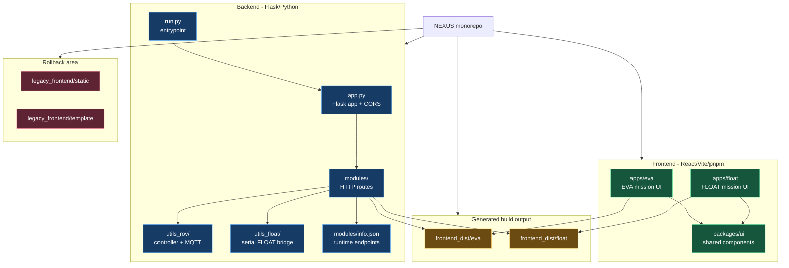
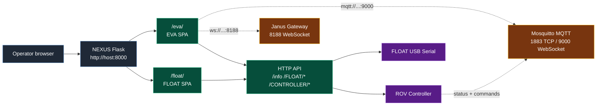
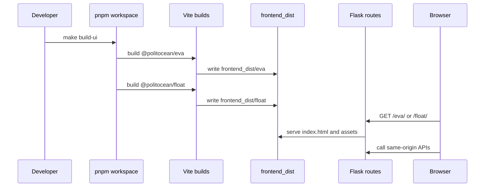
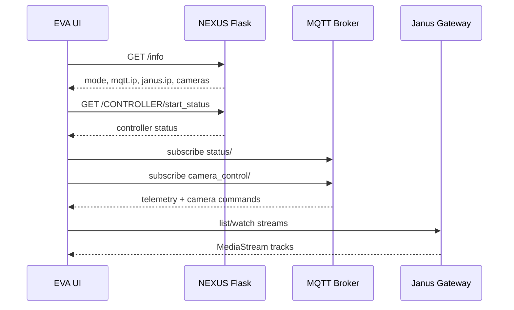
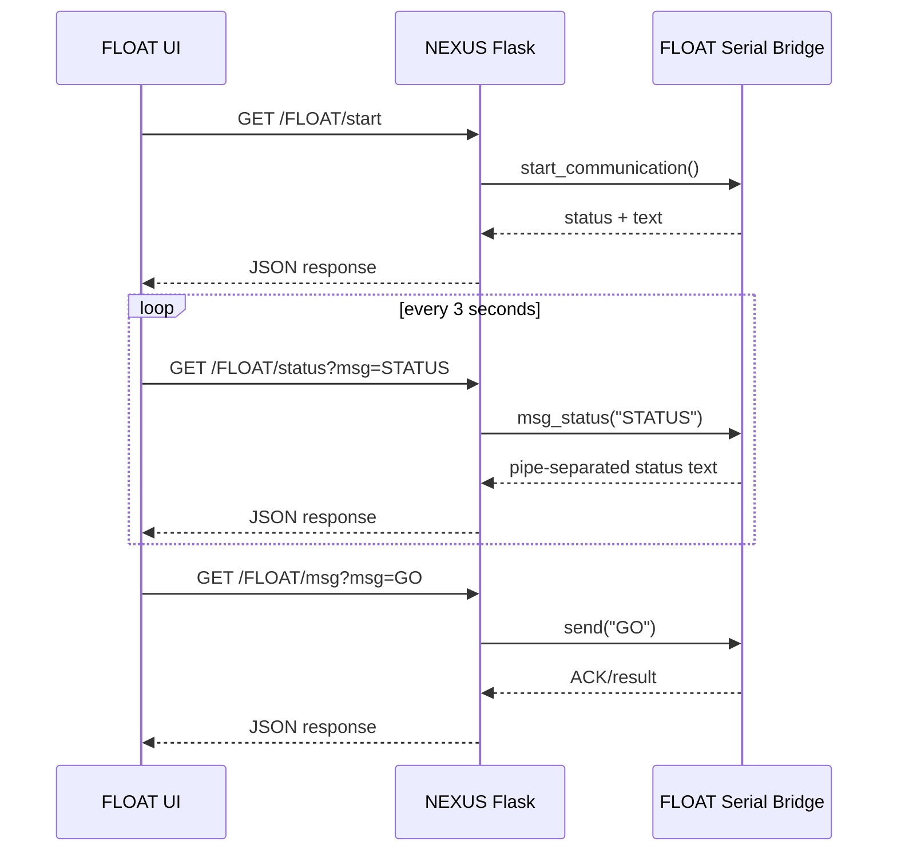

# NEXUS - Navigation EXploration User System

**Repository type:** Backend + frontend monorepo  
**Team:** PoliTOcean @ Politecnico di Torino  
**Role:** Operator station for EVA ROV and FLOAT missions

--------------------------------------------------------------------------

## TABLE OF CONTENTS

- [Project Overview](#project-overview)
- [System Architecture](#system-architecture)
- [Repository Layout](#repository-layout)
- [Runtime Modes and Routes](#runtime-modes-and-routes)
- [Installation](#installation)
- [Development Workflows](#development-workflows)
- [Mock Tests and Local Simulation](#mock-tests-and-local-simulation)
- [Backend API Contract](#backend-api-contract)
- [Frontend Workspace](#frontend-workspace)
- [Legacy Frontend](#legacy-frontend)
- [Troubleshooting](#troubleshooting)

--------------------------------------------------------------------------

## PROJECT OVERVIEW

NEXUS is the mission-station software used to operate PoliTOcean systems from a control computer. It contains:

- a **Flask backend** for hardware-facing services and HTTP APIs;
- an **EVA frontend** for ROV telemetry, cameras, controller state, and mission control;
- a **FLOAT frontend** for serial connection, commands, profile data, packages, and logs;
- test utilities for MQTT, Janus/WebRTC, and mission telemetry simulation.

The current repository is a monorepo. The old static Flask UI has been kept in `legacy_frontend/` for rollback, while the active React/Vite UI lives in `frontend/` and is served by Flask after build.

### Mission Responsibilities

| Area | Responsibility |
|:-----|:---------------|
| EVA ROV | Read telemetry from MQTT, display controller status, switch cameras, render Janus or debug streams. |
| FLOAT | Open/check serial communication, send commands to the FLOAT bridge, fetch profile data, show packages/logs. |
| Backend | Expose stable HTTP routes, manage controller startup, talk to serial devices, provide runtime configuration. |
| Frontend | Provide operator-grade interfaces for EVA and FLOAT without embedding hardware logic in the browser. |

--------------------------------------------------------------------------

## SYSTEM ARCHITECTURE

### Monorepo Architecture



### Runtime Deployment



### Build and Serve Flow



--------------------------------------------------------------------------

## REPOSITORY LAYOUT

```text
NEXUS/
  app.py                      Flask app setup, JSON provider, CORS
  run.py                      Main backend entrypoint
  install.sh                  Python + frontend installation script
  makefile                    Developer commands
  requirements.txt            Python dependencies

  modules/
    index.py                  Launcher, SPA serving, /info route
    joystick.py               /CONTROLLER/start_status
    float.py                  /FLOAT/* routes
    info.json                 debug/production runtime endpoints

  utils_rov/
    controller.py             ROV controller orchestration
    mqtt_c.py                 MQTT client wrapper
    main.py                   Controller initialization entrypoint
    config/                   ROV/controller configuration

  utils_float/
    float.py                  FLOAT serial protocol helper
    config/                   FLOAT serial/config data

  frontend/
    apps/eva/                 EVA React app
    apps/float/               FLOAT React app
    packages/ui/              Shared UI/design-system package
    package.json              pnpm workspace scripts
    pnpm-workspace.yaml       Workspace package list
    turbo.json                Turbo task graph

  frontend_dist/              Generated Vite output, ignored by Git
    eva/
    float/

  legacy_frontend/            Previous HTML/CSS/JS Flask frontend
  tests/                      MQTT, EVA telemetry, Janus, FLOAT test utilities
```

`frontend_dist/` is generated by `make build-ui` or `./install.sh`. Do not edit it manually.

--------------------------------------------------------------------------

## RUNTIME MODES AND ROUTES

NEXUS reads the runtime mode from `run.py --mode`. The mode selects endpoints from `modules/info.json`.

Default local backend port is `8000`. This avoids the common macOS AirPlay Receiver conflict on port `5000`. Override it with `NEXUS_PORT` or `--port` when needed.

| Mode | Purpose | MQTT | Janus |
|:-----|:--------|:-----|:------|
| `debug` | Local development and UI tests | `mqtt://127.0.0.1:9000` | `ws://127.0.0.1:8188` |
| `production` | Vehicle network deployment | `mqtt://10.0.0.254:9000` | `ws://10.0.0.69:8188` |

### Main Routes

| Route | Served by | Description |
|:------|:----------|:------------|
| `/` | Flask template | Mission launcher with EVA/FLOAT links. |
| `/eva/` | `frontend_dist/eva` | EVA React app. |
| `/float/` | `frontend_dist/float` | FLOAT React app. |
| `/ROV` | redirect | Compatibility redirect to `/eva/`. |
| `/FLOAT` | redirect | Compatibility redirect to `/float/`. |
| `/CAMERAS` | redirect | Compatibility redirect to `/eva/`. |
| `/info` | Flask API | Runtime mode, MQTT, Janus, camera metadata, status list. |
| `/CONTROLLER/start_status` | Flask API | Starts/checks the ROV controller thread and joystick state. |
| `/FLOAT/*` | Flask API | FLOAT serial connection, commands, status, profile data. |

--------------------------------------------------------------------------

## INSTALLATION

### Requirements

| Tool | Minimum / expected |
|:-----|:-------------------|
| Python | 3.10+ recommended |
| Node.js | 20+ |
| pnpm | 9.x, via Corepack or local install |
| Mosquitto | Needed for EVA MQTT mock tests |
| Janus | Optional for real WebRTC stream tests |

### One-command Setup

```bash
cd /Users/filippo/Documents/politocean/NEXUS
./install.sh
```

The install script does the following:

1. creates or reuses `venv`;
2. installs `requirements.txt`;
3. enters `frontend/`;
4. enables Corepack if `pnpm` is missing and Corepack is available;
5. runs `pnpm install --frozen-lockfile`;
6. builds EVA and FLOAT into `frontend_dist/`.

### Dev Container

The repository includes a VS Code devcontainer for a reproducible mission-station environment. It installs Python, Node/pnpm, Mosquitto, and the native build tools required by the backend dependencies.

Use it from VS Code with **Dev Containers: Reopen in Container**. On first creation it runs `./install.sh`; on every container start it launches Mosquitto with `.devcontainer/mosquitto.conf`.

Forwarded ports:

| Port | Service |
|:-----|:--------|
| `8000` | NEXUS Flask default |
| `5000` | Flask alternate |
| `1883` | MQTT TCP |
| `9000` | MQTT WebSocket |
| `8088` | Janus HTTP |
| `8188` | Janus WebSocket |

--------------------------------------------------------------------------

## DEVELOPMENT WORKFLOWS

### Make Targets

| Command | What it does | When to use |
|:--------|:-------------|:------------|
| `make install` | Runs `./install.sh`. | Fresh checkout or dependency refresh. |
| `make build-ui` | Builds EVA/FLOAT only. | Before serving UI from Flask. |
| `make dev-backend` | Runs `python3 run.py --mode debug --port 8000`. | Local backend/API development. |
| `make dev-eva` | Runs Vite EVA with `VITE_NEXUS_BASE_URL=http://127.0.0.1:8000`. | Fast EVA UI development. |
| `make dev-float` | Runs Vite FLOAT with the local backend URL. | Fast FLOAT UI development. |
| `make nexus` | Builds UI, then starts production backend mode. | Integrated production-like run. |
| `make controller` | Runs only the ROV controller entrypoint. | Controller debugging. |
| `make test` | Alias for debug backend startup. | Historical compatibility. |

### Integrated Flask Run

Build the UI and serve it from Flask:

```bash
make build-ui
make dev-backend
```

Open:

```text
http://127.0.0.1:8000/
http://127.0.0.1:8000/eva/
http://127.0.0.1:8000/float/
```

In this mode the frontend uses same-origin API calls, so browser requests go back to the same Flask host.

### Vite Development Run

Run the backend in one terminal:

```bash
make dev-backend
```

Run one frontend app in another terminal:

```bash
make dev-eva
# or
make dev-float
```

The Vite apps use `VITE_NEXUS_BASE_URL=http://127.0.0.1:8000` so API calls still reach Flask.

--------------------------------------------------------------------------

## MOCK TESTS AND LOCAL SIMULATION

### EVA UI Without Real Janus Cameras

In debug mode, `/info` returns camera metadata. EVA uses that metadata to create debug canvas camera streams, so a local Janus instance is not required for basic UI testing.

### EVA MQTT Realistic Mission Mock

This is the recommended local smoke test for EVA telemetry.

1. Start Mosquitto with TCP and WebSocket listeners:

```bash
sudo mosquitto -v -c tests/mosquitto/mosquitto.conf
```

The config exposes:

| Listener | Purpose |
|:---------|:--------|
| `1883` | Python publishers and ordinary MQTT clients. |
| `9000` | Browser MQTT over WebSocket, consumed by EVA. |

2. Start the backend:

```bash
make dev-backend
```

3. In another terminal, publish a deterministic EVA mission profile:

```bash
source venv/bin/activate
python tests/eva/eva_realistic_mission.py --host 127.0.0.1 --port 1883 --loop
```

4. Open EVA:

```text
http://127.0.0.1:8000/eva/
```

Expected result:

- backend is online;
- MQTT connects through `mqtt://127.0.0.1:9000`;
- telemetry, attitude, depth, and mode cards update;
- camera panes show debug streams.

### EVA Random MQTT Stress Sender

For noisy/random telemetry:

```bash
source venv/bin/activate
python tests/mosquitto/test_mqtt.py
```

Use this when you want to stress UI rendering rather than replay a realistic mission.

### Optional Janus/WebRTC Stream Test

The older Janus test harness is still available under `tests/stream_video/JANUS_WEBRTC/`.

```bash
chmod +x tests/stream_video/JANUS_WEBRTC/install.sh
./tests/stream_video/JANUS_WEBRTC/install.sh
```

The combined legacy test runner expects Mosquitto, Janus, a Python venv, and a `tests/stream_video/test_video.mp4` file:

```bash
sudo tests/run_tests.sh ./venv
```

This path is useful for stream infrastructure testing. It is not required for the default EVA debug-camera workflow.

### FLOAT Smoke Test Without Hardware

Without an ESP32/FLOAT serial bridge connected, the backend should still respond predictably:

```bash
make dev-backend
curl http://127.0.0.1:8000/FLOAT/status?msg=STATUS
```

Expected response shape:

```json
{"code":"FLOAT","status":false,"text":"SERIAL NOT OPENED"}
```

This confirms Flask and the FLOAT API route are reachable. Full FLOAT command tests require the ESPB bridge or test firmware.

### FLOAT Hardware/Test Firmware

The test notes currently expect flashing:

```text
tests/float/float.ino
```

to an ESP32 used as a FLOAT-side simulator/bridge. Once connected, open:

```text
http://127.0.0.1:8000/float/
```

and use the UI to run `START`, `STATUS`, command, package, and profile workflows.

--------------------------------------------------------------------------

## BACKEND API CONTRACT

### EVA API

| Method | Path | Owner | Purpose |
|:-------|:-----|:------|:--------|
| `GET` | `/info` | `modules/index.py` | Returns runtime configuration. |
| `GET` | `/CONTROLLER/start_status` | `modules/joystick.py` | Starts/checks ROV controller and joystick status. |

### EVA Realtime Contract

The EVA UI reads `/info`, then connects to MQTT and Janus/WebRTC.



Known EVA MQTT topics:

| Topic | Direction | Payload |
|:------|:----------|:--------|
| `status/` | Broker -> UI | JSON telemetry and controller-mode state. |
| `camera_control/` | Broker -> UI | Text containing `NEXT_CAMERA` or `PREV_CAMERA`. |

Important `status/` fields consumed by EVA include:

- `rov_armed`, `work_mode`, `torque_mode`
- `controller_state.DEPTH`, `controller_state.ROLL`, `controller_state.PITCH`
- `depth`, `reference_z`
- `roll`, `pitch`, `yaw`, `reference_pitch`

### FLOAT API

| Method | Path | Owner | Purpose |
|:-------|:-----|:------|:--------|
| `GET` | `/FLOAT/start` | `modules/float.py` | Opens/checks serial communication. |
| `GET` | `/FLOAT/status?msg=STATUS` | `modules/float.py` | Polls FLOAT status text. |
| `GET` | `/FLOAT/msg?msg=<command>` | `modules/float.py` | Sends a FLOAT command. |
| `GET` | `/FLOAT/listen` | `modules/float.py` | Reads profile data after `LISTENING`. |

### FLOAT Command Flow



Common FLOAT commands from the UI:

| Command | Purpose |
|:--------|:--------|
| `GO` | Run the mission profile. |
| `BALANCE` | Run balance routine. |
| `CLEAR_SD` | Clear stored profile/log data on the FLOAT side. |
| `SWITCH_AUTO_MODE` | Toggle autonomous mode. |
| `SEND_PACKAGE` | Request the current data package. |
| `TRY_UPLOAD` | Trigger OTA/upload flow. |
| `HOME_MOTOR` | Home the motor system. |
| `STOP` | Emergency stop. |
| `PARAMS <kp> <ki> <kd>` | Update PID parameters. |
| `TEST_FREQ <frequency>` | Configure test frequency. |
| `TEST_STEPS <steps>` | Run test steps. |
| `LISTENING` | Prepare backend/profile data transfer. |

Known status tokens parsed by the UI:

- `CONNECTED`
- `CONNECTED_W_DATA`
- `EXECUTING_CMD`
- `AUTO_MODE_YES` / `AUTO_MODE_NO`
- `CONN_OK` / `CONN_LOST`
- `BATTERY:<value>`
- `RSSI:<value>`
- `NO USB`
- `DISCONNECTED`
- `TIMEOUT_ON_<command>`

--------------------------------------------------------------------------

## FRONTEND WORKSPACE

The frontend workspace is copied from the former `politocean-ui` repository and now lives inside `frontend/`.

### Workspace Apps

| Package | Path | Description |
|:--------|:-----|:------------|
| `@politocean/eva` | `frontend/apps/eva` | EVA ROV mission control. |
| `@politocean/float` | `frontend/apps/float` | FLOAT mission control. |
| `@politocean/ui` | `frontend/packages/ui` | Shared components, primitives, styles, types. |

### Frontend Scripts

Run from `frontend/`:

| Command | Purpose |
|:--------|:--------|
| `pnpm build:apps` | Build only EVA and FLOAT into `../frontend_dist`. |
| `pnpm --filter @politocean/eva dev` | Start EVA Vite dev server. |
| `pnpm --filter @politocean/float dev` | Start FLOAT Vite dev server. |
| `pnpm build` | Turbo build for the whole workspace. |
| `pnpm lint` | Turbo lint. |
| `pnpm typecheck` | Turbo typecheck. |
| `pnpm format` | Format workspace code. |

For app development outside Flask, provide the backend URL:

```bash
VITE_NEXUS_BASE_URL=http://127.0.0.1:8000 pnpm --filter @politocean/eva dev
VITE_NEXUS_BASE_URL=http://127.0.0.1:8000 pnpm --filter @politocean/float dev
```

For production Flask serving, no frontend environment variable is needed: the UI uses same-origin API calls.

--------------------------------------------------------------------------

## LEGACY FRONTEND

The previous Flask template/static frontend has been moved to:

```text
legacy_frontend/template/
legacy_frontend/static/
```

It is kept for rollback and comparison only. Active routes use the React builds from `frontend_dist/`.

--------------------------------------------------------------------------

## TROUBLESHOOTING

### EVA shows no telemetry

Check that Mosquitto is running with both listeners:

```bash
sudo mosquitto -v -c tests/mosquitto/mosquitto.conf
```

Then confirm that a publisher is sending to TCP port `1883` and that `/info` points EVA to WebSocket port `9000` in debug mode.

### Browser calls `127.0.0.1` when served from another machine

For Flask-served production builds, the UI should call same-origin routes. Rebuild with:

```bash
make build-ui
```

Only Vite development should use `VITE_NEXUS_BASE_URL`.

### `/eva/` or `/float/` returns missing files

Build the UI first:

```bash
make build-ui
```

The generated files should exist under:

```text
frontend_dist/eva/index.html
frontend_dist/float/index.html
```

### FLOAT reports `SERIAL NOT OPENED`

This is expected without the FLOAT bridge connected. Connect the ESPB/serial bridge, confirm permissions for the serial device, then call `/FLOAT/start` or open `/float/`.
